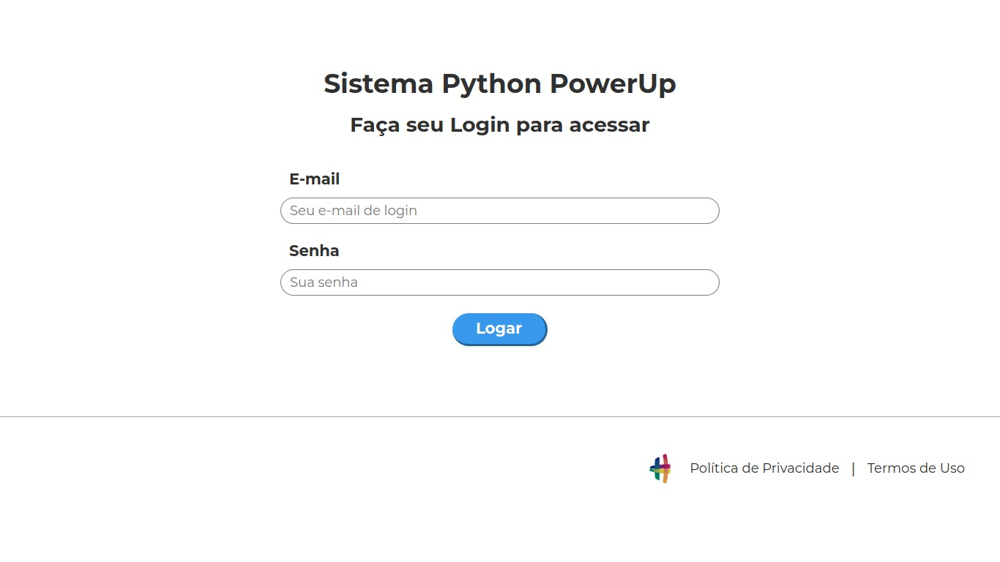
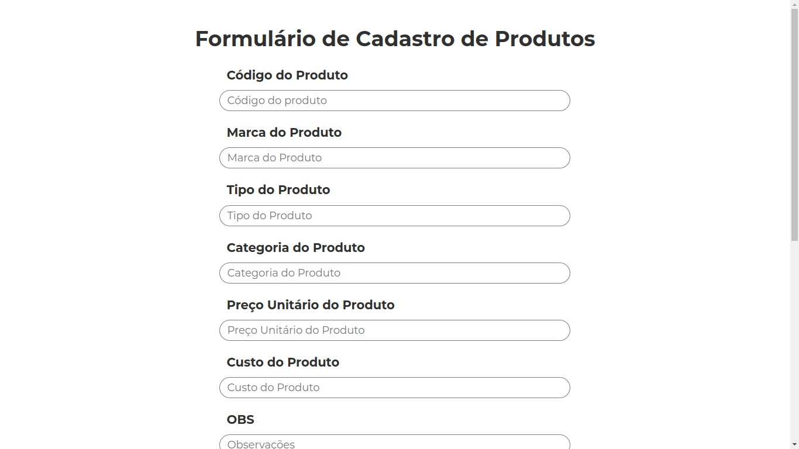

# Automação 

Fiz esse projeto com a ajuda do canal [Hashtag Programação](https://youtube.com/@HashtagProgramacao), no evento "Python Power Up".

⚠️ Obs Importante:
Na aplicação utilizo um site disponibilizado pela Hashtag para o cadastro dos produtos, muito provavelmente esse site irá sair do ar e a aplicação deverá ser atualizada.

## 🔧 Como desenvolvi?

Primeiro fiz a lógica da minha aplicação, separando as ações que deveriam ser feitas em passos a serem seguidos. Usando a biblioteca [PyAutoGui](https://pyautogui.readthedocs.io/en/latest/) ditei todas as ações necessárias para a automação em meu computador, como execução de aplicações, login e importação de dados do arquivo "produtos.csv".

- IDE: [Visual Studio Code](https://code.visualstudio.com/download)

## ⚙️ Como rodar a automação localmente? 

**Clone o projeto**

```bash
  git clone https://github.com/n33miaz/Cadastro-de-Produtos
```

**Entre no diretório do projeto**

```bash
  cd Cadastro-de-Produtos
```

**Instale as dependências**

Windows: https://www.python.org/downloads/

Linux:
```bash
  sudo apt-get install python3.9
```

**Após isso é só executar com o auxílio da sua IDE**

## 📷 Prints do site da automação: 

 


